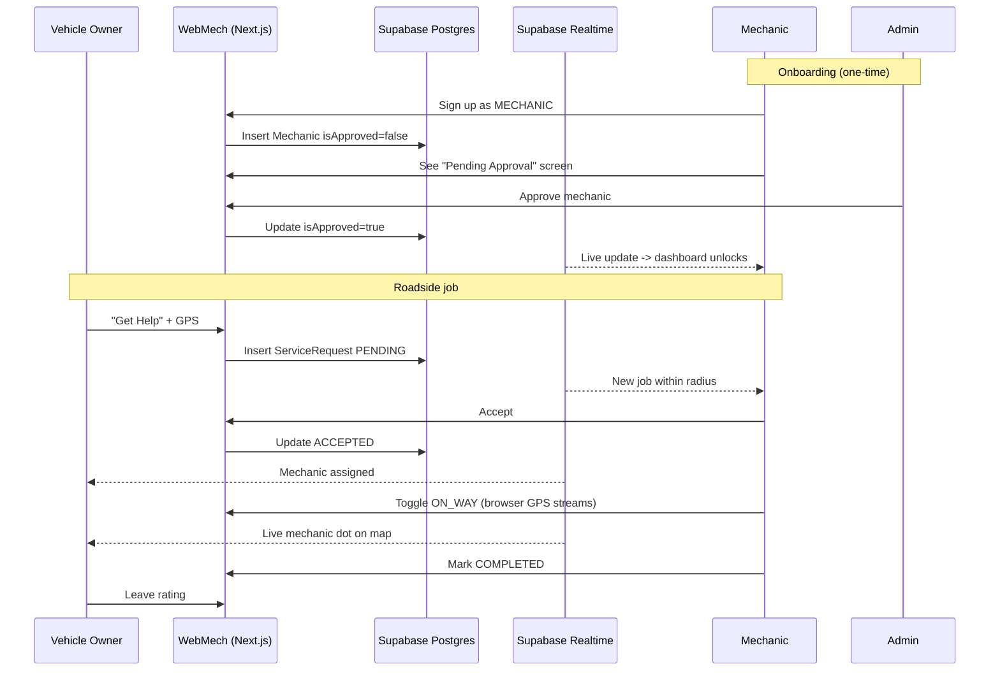
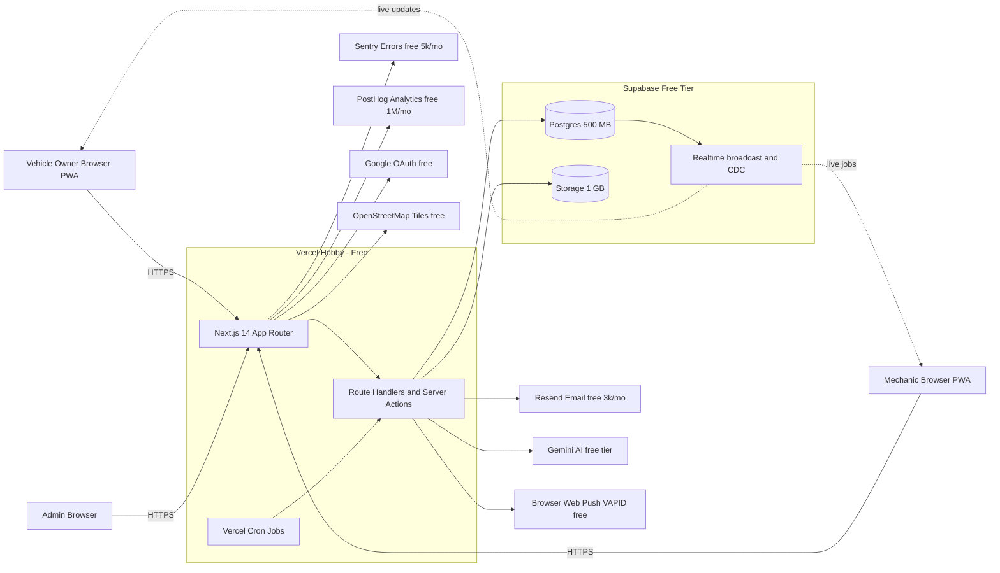
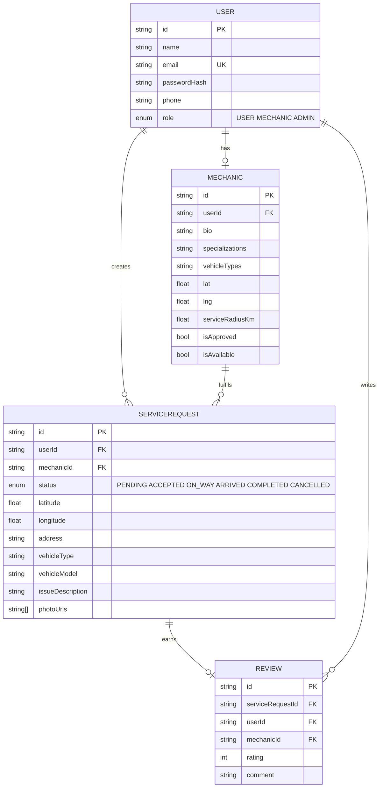

# WebMech — Roadside Assistance, Built for Free

> Stuck on the road? Tap "Get Help" — a verified mechanic nearby gets your job in seconds, drives to you, you watch them move on a live map, pay when done.
>
> Built entirely on **free-tier infrastructure**. Zero monthly cost. Pay only per real-world payment transaction (if/when you take payments).

---

## 1. The Problem

When a vehicle breaks down on the road, the owner has no easy way to:

- Find a mechanic **near their exact location**
- See if the mechanic is **actually available right now**
- Track whether the mechanic is **on the way**
- Verify the mechanic is **trustworthy** (ratings, approvals)

Existing options (calling random local garages, generic roadside services tied to a single insurer) are slow, opaque, and city-only.

## 2. The Solution

A two-sided marketplace web app:

- **Vehicle owners** post a breakdown with one tap; GPS is auto-captured.
- **Mechanics** (after admin approval) see jobs within their service radius, accept the closest one, and broadcast their live location while driving.
- **Admins** keep the supply side trustworthy by approving each mechanic before they receive any jobs.

Installable as a PWA — users add it to their home screen and it behaves like an app.

---

## 3. Personas & Roles

| Role | Who they are | What they do |
|---|---|---|
| `USER` | Vehicle owner | Sign up, report a breakdown, track mechanic, rate after job |
| `MECHANIC` | Service provider | Sign up (wait for approval), accept jobs, drive, mark complete |
| `ADMIN` | Platform operator | Approve / reject mechanics, monitor all activity |

---

## 4. Core User Flows



---

## 5. Feature List

### Already built (MVP)

- Role-aware signup (Vehicle Owner / Mechanic tabs)
- Role-aware login with tab validation
- Three distinct dashboards gated by middleware (USER / MECHANIC / ADMIN)
- Service request CRUD + state machine: `PENDING → ACCEPTED → ON_WAY → ARRIVED → COMPLETED` (or `CANCELLED`)
- Mechanic profile with bio, specializations, vehicle types, service radius
- Admin approval workflow with pending-approval screen for mechanics
- Live GPS broadcasting from mechanic to customer's map (browser geolocation)
- Reviews after completion
- Seeded demo accounts: `admin@webmech.com`, `user@demo.com`, `mech@demo.com` (all `demo123` / `admin123`)

### To add (cost-free roadmap)

- True realtime (replace 5–10 s SWR polling) via **Supabase Realtime**
- **Google OAuth** as a second login option (free)
- **Web Push notifications** for new jobs / status changes (free, no SMS bill)
- **PWA install** — add to home screen, splash screen, offline shell
- **Photo upload** for breakdown context, stored in **Supabase Storage**
- **Welcome / verification emails** via **Resend** free tier
- **Background job** to auto-assign unaccepted requests after 60 s (Vercel Cron)
- **Error tracking** via **Sentry** free tier
- **Product analytics** via **PostHog** free tier
- **Optional AI triage** of the issue description using **Google Gemini** free API

---

## 6. The 100% Free Tech Stack

Every choice below has a permanent free tier generous enough for an MVP and a real small business. Nothing here requires a credit card.

| Layer | Tech | Free tier limit | Why this one |
|---|---|---|---|
| App framework | **Next.js 14** (App Router) + TypeScript | open source | Single repo for UI + API + middleware |
| Hosting | **Vercel Hobby** | 100 GB bandwidth/mo, serverless functions, edge | Zero-config Next.js deploys, free HTTPS, preview URLs |
| Database | **Supabase** (Postgres) | 500 MB DB, 50 k monthly active users | Real Postgres, not a toy. Includes Auth + Realtime + Storage |
| Auth | **Auth.js (NextAuth v5)** + Google OAuth | OAuth is free from Google forever | Already in the project |
| Realtime | **Supabase Realtime** (Postgres CDC + broadcast) | 2 M messages/mo | DB row changes pushed to clients with no extra service |
| File storage | **Supabase Storage** | 1 GB | Same console as DB, signed URLs |
| Maps | **Leaflet + OpenStreetMap tiles** | unlimited, no API key | Already in the project. Truly free, no quotas |
| Push notifications | **Web Push API** + VAPID | unlimited, browser-native | No paid SMS provider needed |
| Email | **Resend** | 3 000 emails/mo, 100/day | Generous for transactional emails |
| Cron / background jobs | **Vercel Cron** | unlimited schedules on Hobby | Built into the same hosting |
| Errors | **Sentry** | 5 000 errors/mo | Industry standard |
| Analytics | **PostHog Cloud** | 1 M events/mo, session replay | Replaces Mixpanel + Hotjar in one |
| AI (optional) | **Google Gemini API** (or **Groq**) | rate-limited but free | Summarize breakdown description, suggest fixes |
| Payments (optional) | **Razorpay** (India) or **Stripe** | no monthly fee, per-transaction only | Costs only when you make money |
| DNS / domain | **Cloudflare DNS** + `*.vercel.app` subdomain | free | Custom domain is the only optional paid item (~$10/yr) |
| Source control & CI | **GitHub** + Vercel auto-deploy | free | Push to deploy |

**Total recurring cost: ₹0 / $0.** A custom domain is the single optional expense.

---

## 7. Target Architecture



---

## 8. Data Model



---

## 9. API Surface

| Method | Path | Purpose | Role |
|---|---|---|---|
| POST | `/api/register` | Create USER or MECHANIC account | public |
| ALL | `/api/auth/[...nextauth]` | Login / logout / session | public |
| GET / POST | `/api/requests` | List own requests / create new | USER |
| GET / PATCH / DELETE | `/api/requests/[id]` | Detail / status / cancel | USER+MECHANIC |
| GET | `/api/mechanics/nearby` | Find mechanics near a coordinate | USER |
| GET | `/api/mechanic/requests` | Pending jobs in radius | MECHANIC |
| GET / PATCH | `/api/mechanic/profile` | Read / update profile | MECHANIC |
| PATCH | `/api/mechanic/location` | Update GPS + availability | MECHANIC |
| GET / PATCH | `/api/admin/mechanics` | Approval workflow | ADMIN |
| POST | `/api/reviews` | Submit rating | USER |
| POST | `/api/upload` | Issue a Supabase Storage signed upload URL *(new)* | USER |
| POST | `/api/push/subscribe` | Save Web Push subscription *(new)* | any |
| POST | `/api/cron/auto-assign` | Vercel Cron handler *(new)* | server |

---

## 10. Pages Map

| Path | Who sees it |
|---|---|
| `/` | Marketing landing (anyone) |
| `/login` | Login with three role tabs (anyone not logged in) |
| `/signup` | Signup with USER / MECHANIC tabs (anyone) |
| `/dashboard` | Vehicle owner dashboard — active request, history, "Get Help" |
| `/dashboard/request` | New request form (GPS + issue) |
| `/dashboard/track/[id]` | Live tracking with mechanic on map |
| `/mechanic/pending` | "Waiting for admin approval" screen |
| `/mechanic/dashboard` | Mechanic — pending jobs, active job, live GPS toggle, map |
| `/admin` | Mechanic approval queue + all-requests view |

All protected by `src/middleware.ts`, which reads `role` and `mechanicApproved` from the JWT.

---

## 11. Zero-Cost Deployment Recipe

A first-time deploy from a clean machine to a live URL — should take ~20 minutes. Nothing below requires entering a credit card.

### Accounts to create (all free, sign in with GitHub)

1. [GitHub](https://github.com) — push code here
2. [Vercel](https://vercel.com) — hosting (sign in with GitHub)
3. [Supabase](https://supabase.com) — Postgres + Storage + Realtime
4. [Resend](https://resend.com) — transactional emails
5. [Sentry](https://sentry.io) — error tracking (optional)
6. [PostHog](https://posthog.com) — analytics (optional)
7. [Google Cloud Console](https://console.cloud.google.com) — Google OAuth client (optional)

### Steps

1. **Push to GitHub:** `git remote add origin <your-repo> && git push -u origin main`
2. **Supabase project:** New project → copy `DATABASE_URL` (Settings → Database → Connection string → "URI"), `SUPABASE_URL`, `SUPABASE_ANON_KEY`, `SUPABASE_SERVICE_ROLE_KEY`.
3. **Schema:** locally run `npx prisma db push` against the Supabase URL once. Then `node prisma/seed.js` to seed demo accounts.
4. **Resend:** create API key, add a verified sender email (your own works for testing).
5. **Google OAuth (optional):** OAuth 2.0 Client ID, authorized redirect `https://<your-domain>/api/auth/callback/google`.
6. **Vercel import:** "New Project" → pick your GitHub repo → set the env vars below → Deploy.
7. **Custom domain (optional, only paid step):** ~$10/yr from any registrar. Add to Vercel.

### Required env vars

```bash
DATABASE_URL=                # from Supabase
DIRECT_URL=                  # Supabase direct connection (for migrations)
NEXTAUTH_URL=                # https://your-app.vercel.app
NEXTAUTH_SECRET=             # openssl rand -base64 32

# Stage 2+ (all optional, app works without them)
NEXT_PUBLIC_SUPABASE_URL=
NEXT_PUBLIC_SUPABASE_ANON_KEY=
SUPABASE_SERVICE_ROLE_KEY=
RESEND_API_KEY=
GOOGLE_CLIENT_ID=
GOOGLE_CLIENT_SECRET=
NEXT_PUBLIC_VAPID_PUBLIC_KEY=
VAPID_PRIVATE_KEY=
NEXT_PUBLIC_SENTRY_DSN=
NEXT_PUBLIC_POSTHOG_KEY=
GEMINI_API_KEY=
```

---

## 12. Roadmap to "Production-Practical" (Free Path)

Each milestone is independently shippable. Stop at any point and you still have a working product.

| # | Milestone | Tech | Outcome |
|---|---|---|---|
| 0 | **Done — MVP** | SQLite + SWR polling | Local demo of full flow |
| 1 | Migrate to Supabase Postgres | `@prisma/client` + Supabase | Real DB on the cloud |
| 2 | Deploy to Vercel | Vercel Hobby + GitHub | Live URL |
| 3 | Replace polling with realtime | `@supabase/supabase-js` + Postgres CDC | Truly live status & GPS |
| 4 | Google OAuth | NextAuth Google provider | One-tap signup |
| 5 | Web Push notifications | `web-push` + service worker | Mechanic gets pinged offline |
| 6 | PWA install + offline shell | `next-pwa` + manifest | Add-to-home-screen |
| 7 | Photo upload | Supabase Storage | Customer attaches breakdown photo |
| 8 | Transactional email | Resend | Welcome + status emails |
| 9 | Auto-assign cron | Vercel Cron | Nearest mechanic auto-picked after 60 s |
| 10 | Sentry + PostHog | Both free tiers | Know when things break & how users behave |
| 11 | (Optional) AI issue triage | Google Gemini free | Auto-suggest the likely fix |
| 12 | (Optional) Razorpay payments | Razorpay | Charge after job completion |

---

## 13. What's NOT in this Stack (and Why)

| Technology | Why we skipped it |
|---|---|
| Twilio SMS | Pay-per-message. Replaced by Web Push (free, browser-native). |
| Pusher / Ably (realtime) | Free tier exists but lower limits than Supabase Realtime. One less account. |
| Mapbox / Google Maps | Has free tier but rate-limited. Leaflet + OSM has no quota. |
| MongoDB Atlas | Postgres is more capable on Supabase free tier. |
| Inngest, Trigger.dev | Vercel Cron is enough for this scale and zero extra config. |
| UploadThing / Cloudinary | Supabase Storage already included. |
| Auth0 / Clerk | NextAuth + Google OAuth is free; the others gate features behind paid tiers. |
| AWS / GCP / Azure | Free tiers require a credit card and complex setup; one mistake → big bill. |
| Native mobile (Swift / Kotlin) | PWA covers 95 % at zero cost and zero app store fees. |

---

## 14. Local Development

```powershell
# 1. Install deps
npm install

# 2. Generate Prisma client + push schema (uses SQLite locally)
npx prisma generate
npx prisma db push

# 3. Seed demo accounts
node prisma/seed.js

# 4. Run dev server
npm run dev
# -> http://localhost:3000
```

Demo accounts:

| Role | Email | Password |
|---|---|---|
| Admin | `admin@webmech.com` | `admin123` |
| Vehicle owner | `user@demo.com` | `demo123` |
| Mechanic (approved) | `mech@demo.com` | `demo123` |
| Mechanic (pending) | `pendingmech@demo.com` | `demo123` |

---

## 15. Why This Will Actually Work for Real Users

- **Mobile-first PWA** — most breakdowns happen on a phone. Installable, fullscreen, works after the page loads even on a weak signal.
- **Live map + ETA** — the single feature that decides whether a customer trusts the platform.
- **Approval gate** — mechanics can't appear in the directory until reviewed. Quality > quantity.
- **Free to run for years** — Supabase + Vercel + Resend + PostHog free tiers comfortably fit a city's worth of small-business traffic. By the time you grow past it, you have revenue.

---

## 16. Open Questions / Decisions to Make Before Launch

1. **Geography:** start with a single city for tighter mechanic density?
2. **Pricing:** flat per-callout, per-km, or free + tipping?
3. **Trust:** how to verify a mechanic during admin approval — government ID upload, in-person check, both?
4. **Liability:** terms of service + insurance — needed before real charges.
5. **Naming:** "WebMech" is fine for a project, but for a launch you may want a brandable .com (~$10/yr).

---

*This single document captures the entire product. Open it any time to remember where you're going.*
